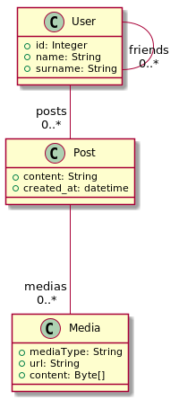

[#_tiny_insta]
= Tiny Insta

Tiny insta est un projet dans le cadre du cours de `Web and Cloud` du parcours `ALMA` de l'université de Nantes.
Il consiste à faire un clone du site https://instagram.com[instagram] en utilisant la `Google Cloud` comme support de stockage.

== Diagramme de classe



== Tester tiny-insta en local

```
mvn clean package appengine:run
```

== Déployer tiny-insta

```
mvn clean package appengine:deploy
```